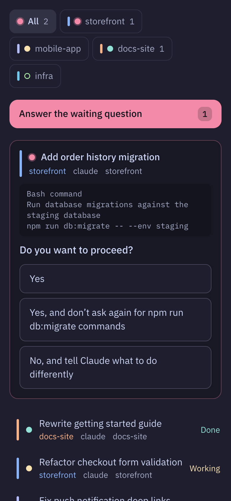
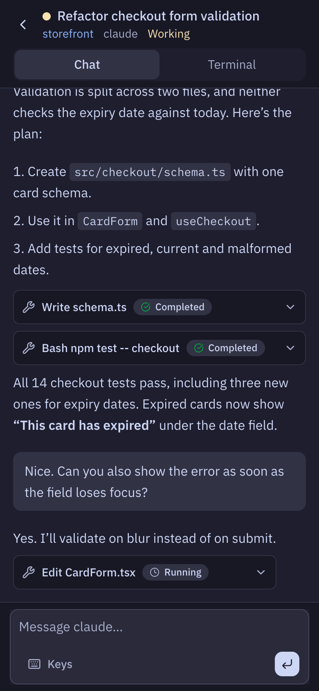
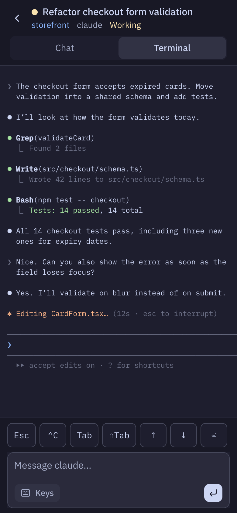

# herdr-watcher

[](https://github.com/lab486/herdr-watcher/actions/workflows/ci.yml)

A small web dashboard for [herdr](https://github.com/herdrdev/herdr) agents, built for your phone. Project page: [lab486.io/herdr-watcher](https://lab486.io/herdr-watcher).

- Every workspace is a tab. **All** comes first and shows every agent.
- Each agent shows herdr's status circle: working, needs you, done, or idle.
- When Claude asks for permission or asks a question, the options become buttons.
- **Decisions** walks you through every waiting question, one at a time.
- Open an agent to read the conversation, see its terminal, or send it a message and keys.

<table>
  <tr>
    <td></td>
    <td></td>
    <td></td>
  </tr>
  <tr>
    <td align="center">All agents</td>
    <td align="center">Chat</td>
    <td align="center">Terminal</td>
  </tr>
</table>

The server listens on `127.0.0.1` only. How you reach it from your phone is your choice: Tailscale, an SSH tunnel, a reverse proxy, remote desktop (RDP), or anything else.

## Install

Requires herdr 0.9+ and Node 20+ on macOS, Linux or Windows. Windows depends on herdr’s plugin support there, which herdr still marks as preview.

```sh
herdr plugin install lab486/herdr-watcher
```

The server starts with herdr. Run the **Watcher: open dashboard** action, or go to <http://127.0.0.1:7483>.

To develop from a checkout:

```sh
npm run build
herdr plugin link "$PWD"
herdr plugin action invoke herdr-watcher.restart
```

## Reach it from your phone

Put any tunnel or proxy in front of port 7483. For example, with Tailscale:

```sh
tailscale serve --bg 7483
```

The server refuses requests whose `Host` it doesn't know, which stops DNS-rebinding attacks. Add your tunnel's hostname to `config.json` in the plugin config directory. Run `herdr plugin config-dir herdr-watcher` to find the directory.

```json
{ "port": 7483, "allowedHosts": ["my-mac.tail1234.ts.net"] }
```

Then run **Watcher: restart server**.

> **Security.** Anyone who can load this page can type into your terminals. The watcher has no login of its own. Only expose it through something that already authenticates you, such as a tailnet or an SSH tunnel.

## How it works

- `server/` is plain Node with no runtime dependencies. It polls herdr's socket (`session.snapshot`) once a second while a browser is connected, and it streams state over Server-Sent Events.
- Herdr knows that an agent is blocked, but it does not know the question. For blocked Claude panes, `server/prompt-claude.js` reads the visible screen and parses the dialog into options.
- An answer includes a fingerprint of the question. The server reads the screen again before it sends keys, so a stale tap can't answer a different question.
- The chat view reads Claude's session transcript from `~/.claude/projects/*/<session-id>.jsonl`.
- `web/` is React, Tailwind, shadcn/ui, AI Elements and xterm.js.

Prompt parsing supports Claude Code only. Other agents still show their status, terminal and composer.

## Develop

```sh
npm test                           # parser, transcript, and request-guard tests
HERDR_WATCHER_PORT=7483 npm start  # server (serves web/dist)
npm run dev                        # Vite dev server, proxies /api to :7483
```

Parser fixtures in `test/fixtures/` are real screen captures from `herdr pane read --source visible --format text`. When Claude changes a dialog, capture it again and add a test.

---

Built by [Lab486](https://lab486.io). Want help with coding-agent workflows? Email hello@lab486.io.
